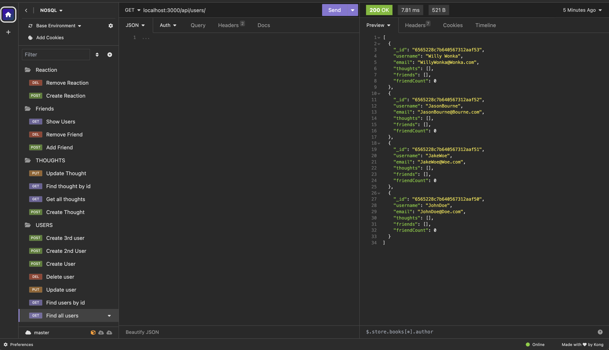
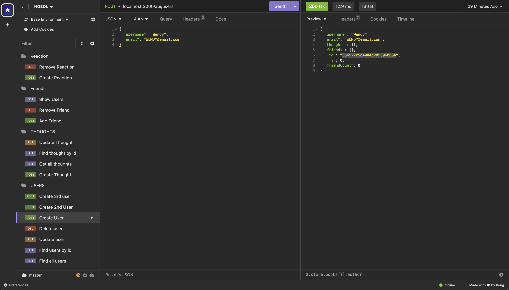
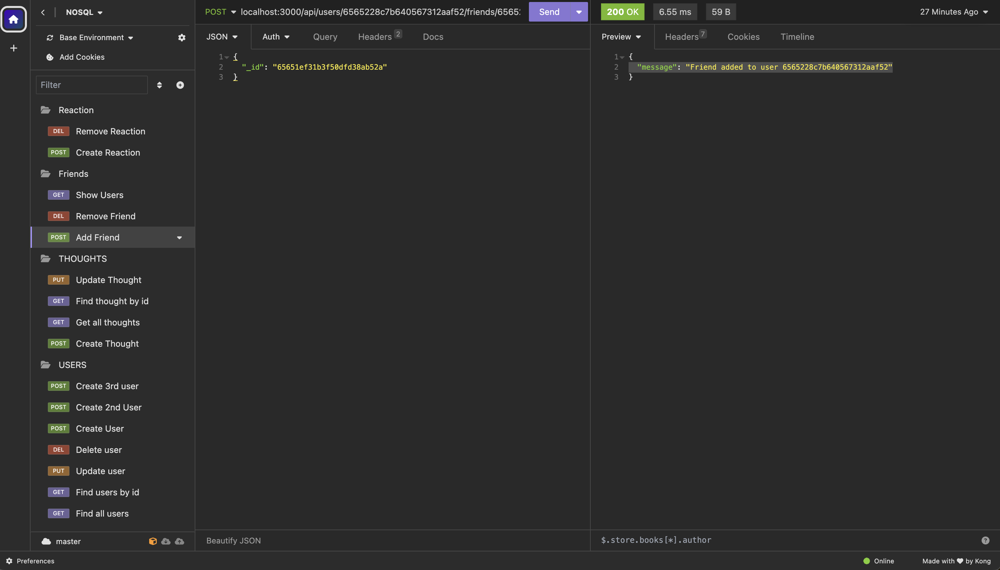
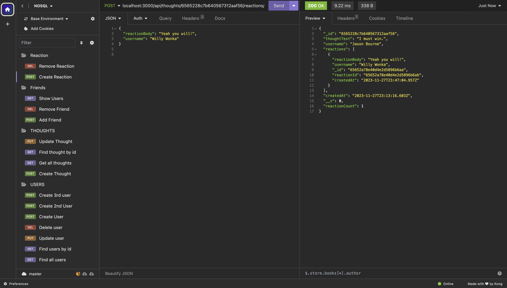

# Overview
This project is an API implementation for a social network web application. Leveraging the power of NoSQL databases, it enables users to post thoughts, react to others' thoughts, and manage their friend lists. The project is built using Node.js, Express.js for handling routes, MongoDB as the database, and Mongoose ODM for data modeling. This backend-focused project utilizes Insomnia for route testing to ensure robust functionality. Each feature aligns with specific acceptance criteria, detailed further in this document.

# User Story
As a modern social media company,
We require a backend API utilizing a NoSQL database,
So that our platform can efficiently manage large volumes of unstructured data.

# Acceptance Criteria Breakdown
* AC01: Launching the Application

Upon invoking the application, the server starts, and Mongoose models synchronize with the MongoDB database.
* AC02: Testing GET Routes

API GET routes for users and thoughts are accessible in Insomnia, displaying data in a structured JSON format.
* AC03: Manipulating Users and Thoughts

The API's POST, PUT, and DELETE routes enable the creation, updating, and deletion of users and thoughts.
* AC04: Managing Reactions and Friends

Users can create and delete reactions to thoughts and manage their friend lists through POST and DELETE routes.

* The following screens show sample CRUD interactions with the application using Insomnia. For a full demonstration, refer to the video at  https://drive.google.com/file/d/1Qr-aPHBhVYlOr_U2BDdCbn7lWaJoQgBG/view?usp=sharing

## Screenshots

## Installation and Setup
* Video Walkthrough: For a visual guide on the application's functionality, visit Video Demo.
* Repository Access: To explore the project's repository, visit GitHub Repo.

## Running the Application
1. Open the project in VSCode.
2. In the root directory, right-click and select 'Open Integrated Terminal'.
3. Set the terminal to Bash.
4. Start the server with npm start.
5. Confirm the server is running on port 3001 with no errors.

## Demonstrations
The application's functionality is showcased through Insomnia interactions. Screenshots of these interactions are available, with a comprehensive demonstration found in the Video Demo.

# Database Models and API Routes

## User Model

* Username: String, unique, required, trimmed.
* Email: String, unique, required, valid format.
* Thoughts: Array of _id values referencing the Thought model.
* Friends: Array of _id values referencing the User model.
* friendCount: Virtual field for the number of friends.
## Thought Model

* Thought Text: String, required, 1-280 characters.
* Created At: Date, default to now, formatted timestamp.
* Username: String, required.
* Reactions: Array with reactionSchema.
* reactionCount: Virtual field for the number of reactions.

## Reaction Schema

* Reaction ID: Mongoose ObjectId, default new ObjectId.
* Reaction Body: String, required, max 280 characters.
* Username: String, required.
* Created At: Date, default to now, formatted timestamp.

## API Routes
* /api/users: GET all users, POST a new user.
* /api/users/:userId: GET, PUT, DELETE a single user.
* /api/users/:userId/friends/:friendId: POST, DELETE friends.
* /api/thoughts: GET all thoughts, POST a new thought.
* /api/thoughts/:thoughtId: GET, PUT, DELETE a single thought.
* /api/thoughts/:thoughtId/reactions: POST, DELETE reactions.

## Acknowledgements
* Express.js: Used for routing (v4.17.1).
* Mongoose: For database management (v7.0.2).
* Dependencies are listed in package.json.

# Links

* Github - https://github.com/jishyk/Social-Network-API